# Machine Learning Models: A Comprehensive Development Guide

## Table of Contents

1. [Introduction](#introduction)
2. [The Machine Learning Pipeline](#the-machine-learning-pipeline)
3. [Data Preparation](#data-preparation)
4. [Model Selection](#model-selection)
5. [Training Process](#training-process)
6. [Evaluation and Validation](#evaluation-and-validation)
7. [Deployment and Monitoring](#deployment-and-monitoring)
8. [Best Practices](#best-practices)
9. [MLOps and Infrastructure](#mlops-and-infrastructure)
10. [Model Governance and Ethics](#model-governance-and-ethics)
11. [AutoML and Advanced Techniques](#automl-and-advanced-techniques)
12. [Common Pitfalls](#common-pitfalls)
13. [Conclusion](#conclusion)

## Introduction

Machine Learning (ML) model development is a systematic process that transforms raw data into predictive systems capable of learning patterns and making intelligent decisions. This documentation provides a comprehensive framework for building robust, scalable, and maintainable ML models.

The journey from problem definition to deployed model requires rigorous methodology, careful consideration of trade-offs, and adherence to established principles. This guide presents the complete lifecycle of ML model development, suitable for both academic study and industrial application.

## The Machine Learning Pipeline

### Overview Schema

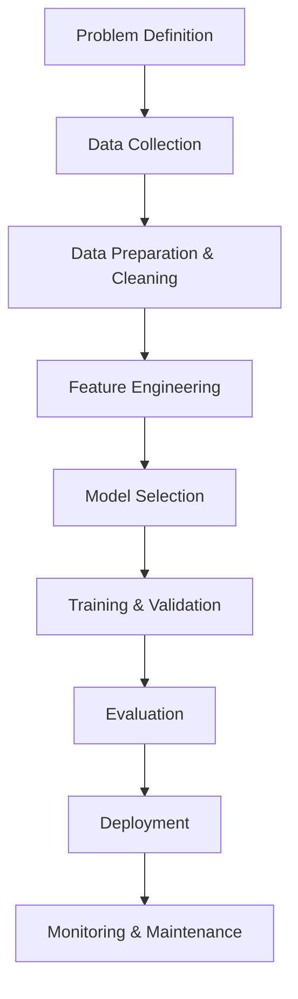

Each stage in this pipeline is critical and interconnected. Failures or oversights at any stage cascade downstream, potentially compromising the entire system.

## Data Preparation

### Data Split Architecture

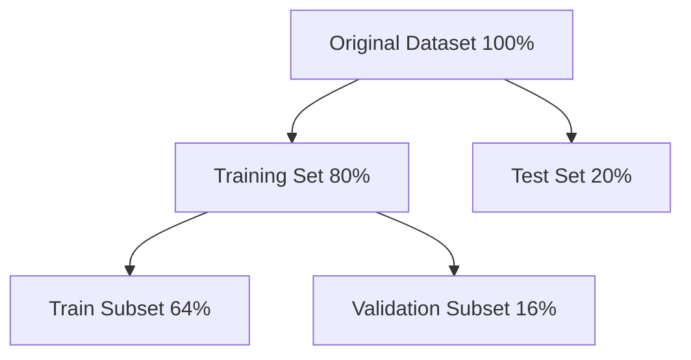

### Data Preprocessing Pipeline

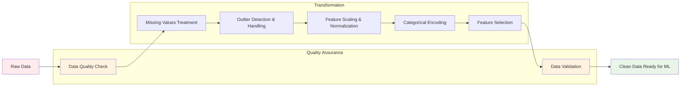

### Data Preprocessing Code Example

```python
import pandas as pd
import numpy as np
from sklearn.preprocessing import StandardScaler, LabelEncoder, OneHotEncoder
from sklearn.impute import SimpleImputer, KNNImputer
from sklearn.compose import ColumnTransformer
from sklearn.pipeline import Pipeline

def create_preprocessing_pipeline(numerical_features, categorical_features):
    """
    Create a comprehensive preprocessing pipeline for ML data.

    Args:
        numerical_features: List of numerical column names
        categorical_features: List of categorical column names

    Returns:
        sklearn Pipeline object
    """

    # Numerical preprocessing pipeline
    numerical_pipeline = Pipeline([
        ('imputer', KNNImputer(n_neighbors=5)),
        ('scaler', StandardScaler())
    ])

    # Categorical preprocessing pipeline
    categorical_pipeline = Pipeline([
        ('imputer', SimpleImputer(strategy='mode')),
        ('onehot', OneHotEncoder(drop='first', sparse=False, handle_unknown='ignore'))
    ])

    # Combine preprocessing steps
    preprocessor = ColumnTransformer([
        ('num', numerical_pipeline, numerical_features),
        ('cat', categorical_pipeline, categorical_features)
    ])

    return preprocessor

# Example usage
def preprocess_data(df, target_column):
    """
    Complete data preprocessing with feature engineering.
    """
    # Separate features and target
    X = df.drop(columns=[target_column])
    y = df[target_column]

    # Identify feature types
    numerical_features = X.select_dtypes(include=['int64', 'float64']).columns.tolist()
    categorical_features = X.select_dtypes(include=['object', 'category']).columns.tolist()

    # Create and fit preprocessing pipeline
    preprocessor = create_preprocessing_pipeline(numerical_features, categorical_features)
    X_processed = preprocessor.fit_transform(X)

    # Create feature names for processed data
    feature_names = (
        numerical_features +
        list(preprocessor.named_transformers_['cat']
             .named_steps['onehot']
             .get_feature_names_out(categorical_features))
    )

    return pd.DataFrame(X_processed, columns=feature_names), y, preprocessor
```

#### Key Preprocessing Steps

1. **Missing Value Treatment**

   * Deletion strategies: listwise, pairwise
   * Imputation methods: mean, median, mode, forward-fill, interpolation
   * Advanced techniques: KNN imputation, MICE, deep learning imputation

2. **Outlier Detection**

   * Statistical methods: Z-score, IQR, Mahalanobis distance
   * Machine learning methods: Isolation Forest, LOF, DBSCAN
   * Domain-specific thresholds

3. **Feature Scaling**

   * Standardization: μ = 0, σ = 1
   * Normalization: \[0, 1] or \[-1, 1]
   * Robust scaling: using median and IQR

## Model Selection

### Model Taxonomy

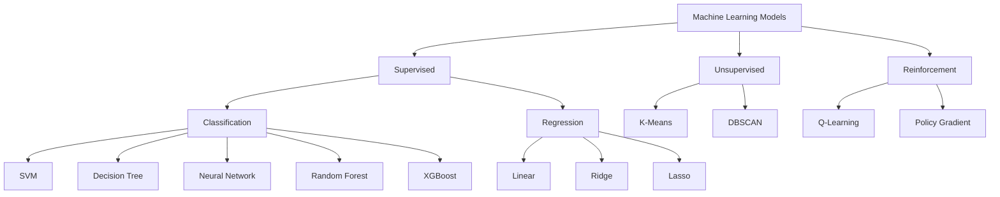

### Model Selection Criteria

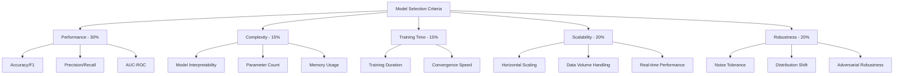

### Algorithm Comparison Matrix

| Algorithm | Accuracy | Speed | Interpretability | Scalability | Memory |
|-----------|----------|-------|------------------|-------------|---------|
| Linear Regression | ⭐⭐⭐ | ⭐⭐⭐⭐⭐ | ⭐⭐⭐⭐⭐ | ⭐⭐⭐⭐⭐ | ⭐⭐⭐⭐⭐ |
| Random Forest | ⭐⭐⭐⭐ | ⭐⭐⭐ | ⭐⭐⭐ | ⭐⭐⭐ | ⭐⭐⭐ |
| XGBoost | ⭐⭐⭐⭐⭐ | ⭐⭐⭐ | ⭐⭐ | ⭐⭐⭐⭐ | ⭐⭐⭐ |
| SVM | ⭐⭐⭐⭐ | ⭐⭐ | ⭐⭐ | ⭐⭐ | ⭐⭐⭐ |
| Neural Network | ⭐⭐⭐⭐⭐ | ⭐⭐ | ⭐ | ⭐⭐⭐⭐ | ⭐⭐ |
| K-Means | ⭐⭐⭐ | ⭐⭐⭐⭐ | ⭐⭐⭐⭐ | ⭐⭐⭐ | ⭐⭐⭐⭐ |

## Training Process

### Training Loop Architecture

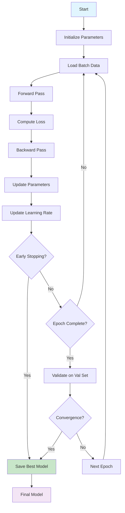

### Training Process Code Example

```python
import numpy as np
from sklearn.model_selection import train_test_split
from sklearn.ensemble import RandomForestClassifier
from sklearn.metrics import accuracy_score, classification_report
import joblib

def train_model(X, y, config):
    """
    Complete training pipeline with validation and model persistence.

    Args:
        X: Feature matrix
        y: Target vector
        config: Model configuration dictionary

    Returns:
        trained_model: Fitted model object
        metrics: Training and validation metrics
    """
    # Split data
    X_train, X_temp, y_train, y_temp = train_test_split(
        X, y, test_size=config['test_size'], random_state=config['random_state']
    )
    X_val, X_test, y_val, y_test = train_test_split(
        X_temp, y_temp, test_size=0.5, random_state=config['random_state']
    )

    # Initialize model
    model = RandomForestClassifier(
        n_estimators=config['n_estimators'],
        max_depth=config['max_depth'],
        random_state=config['random_state']
    )

    # Training loop with validation
    model.fit(X_train, y_train)

    # Validation
    train_pred = model.predict(X_train)
    val_pred = model.predict(X_val)

    metrics = {
        'train_accuracy': accuracy_score(y_train, train_pred),
        'val_accuracy': accuracy_score(y_val, val_pred),
        'train_report': classification_report(y_train, train_pred),
        'val_report': classification_report(y_val, val_pred)
    }

    # Save model
    joblib.dump(model, f"models/{config['model_name']}_v{config['version']}.pkl")

    return model, metrics, (X_test, y_test)
```

### Hyperparameter Optimization

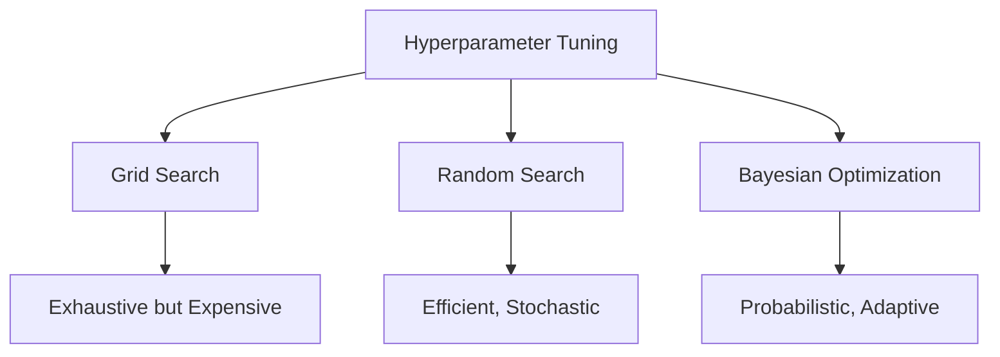

## Evaluation and Validation

### Cross-Validation Schema

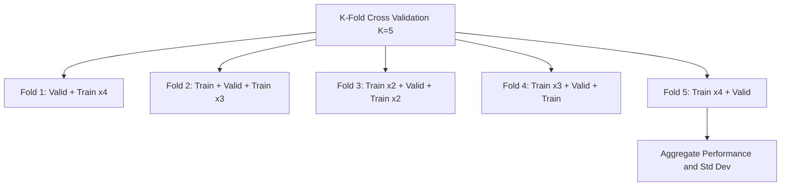

### Evaluation Metrics Framework

#### Classification Metrics

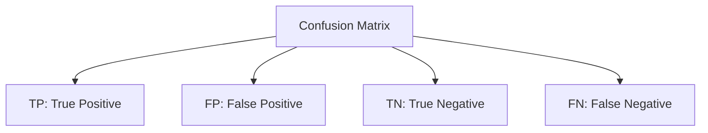

* Precision = TP / (TP + FP)
* Recall = TP / (TP + FN)
* F1 = 2 × (Precision × Recall) / (Precision + Recall)
* Accuracy = (TP + TN) / (TP + TN + FP + FN)

#### Regression Metrics

```
MSE = (1/n) Σ(yi - ŷi)²
RMSE = √MSE
MAE = (1/n) Σ|yi - ŷi|
R² = 1 - (SS_res / SS_tot)
```

### Model Diagnostics

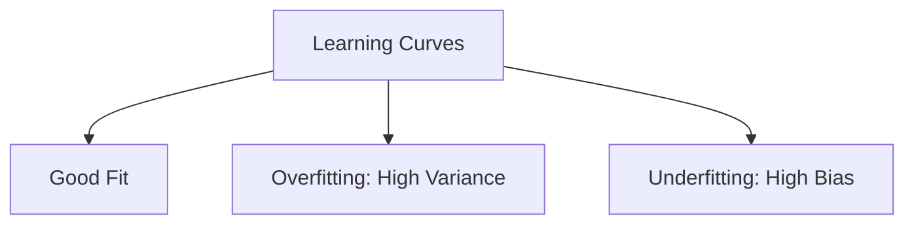

## Deployment and Monitoring

### Deployment Architecture

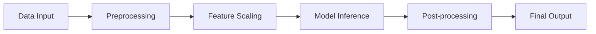

### Model Monitoring Framework

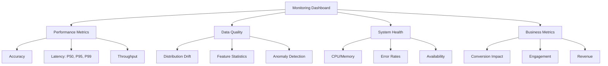

### Container and Infrastructure Schema

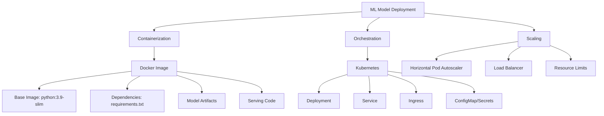

### Model Serving Code Example

```python
from flask import Flask, request, jsonify
import joblib
import pandas as pd
import numpy as np
from datetime import datetime
import logging

# Initialize Flask app
app = Flask(__name__)

# Configure logging
logging.basicConfig(level=logging.INFO)
logger = logging.getLogger(__name__)

class ModelServer:
    def __init__(self, model_path, preprocessor_path):
        """Initialize model server with trained model and preprocessor."""
        self.model = joblib.load(model_path)
        self.preprocessor = joblib.load(preprocessor_path)
        self.prediction_count = 0
        logger.info("Model server initialized successfully")

    def predict(self, data):
        """Make predictions on input data."""
        try:
            # Convert to DataFrame
            df = pd.DataFrame([data])

            # Preprocess data
            X_processed = self.preprocessor.transform(df)

            # Make prediction
            prediction = self.model.predict(X_processed)[0]
            probability = self.model.predict_proba(X_processed)[0].max()

            self.prediction_count += 1

            return {
                'prediction': int(prediction),
                'probability': float(probability),
                'timestamp': datetime.now().isoformat(),
                'model_version': '1.0.0'
            }

        except Exception as e:
            logger.error(f"Prediction error: {str(e)}")
            raise

# Initialize model server
model_server = ModelServer(
    model_path='models/trained_model_v1.0.0.pkl',
    preprocessor_path='models/preprocessor_v1.0.0.pkl'
)

@app.route('/health', methods=['GET'])
def health_check():
    """Health check endpoint."""
    return jsonify({
        'status': 'healthy',
        'predictions_served': model_server.prediction_count,
        'timestamp': datetime.now().isoformat()
    })

@app.route('/predict', methods=['POST'])
def predict():
    """Prediction endpoint."""
    try:
        # Validate input
        if not request.json:
            return jsonify({'error': 'No JSON data provided'}), 400

        # Make prediction
        result = model_server.predict(request.json)
        logger.info(f"Prediction made: {result}")

        return jsonify(result)

    except Exception as e:
        logger.error(f"Prediction endpoint error: {str(e)}")
        return jsonify({'error': str(e)}), 500

@app.route('/metrics', methods=['GET'])
def metrics():
    """Metrics endpoint for monitoring."""
    return jsonify({
        'predictions_total': model_server.prediction_count,
        'model_loaded': bool(model_server.model),
        'uptime': datetime.now().isoformat()
    })

if __name__ == '__main__':
    app.run(host='0.0.0.0', port=5000, debug=False)
```

### Docker Configuration Example

```dockerfile
# Dockerfile for ML model deployment
FROM python:3.9-slim

WORKDIR /app

# Install system dependencies
RUN apt-get update && apt-get install -y \
    gcc \
    && rm -rf /var/lib/apt/lists/*

# Copy requirements and install Python dependencies
COPY requirements.txt .
RUN pip install --no-cache-dir -r requirements.txt

# Copy application code
COPY src/ ./src/
COPY models/ ./models/
COPY schemas/ ./schemas/

# Create non-root user
RUN groupadd -r mluser && useradd -r -g mluser mluser
RUN chown -R mluser:mluser /app
USER mluser

# Expose port
EXPOSE 5000

# Health check
HEALTHCHECK --interval=30s --timeout=10s --start-period=60s --retries=3 \
    CMD curl -f http://localhost:5000/health || exit 1

# Start application
CMD ["python", "src/app.py"]
```

## Best Practices

### Development Workflow

1. **Version Control**

   * Track code, data versions, and model artifacts
   * Use semantic versioning for models
   * Maintain reproducibility through environment specifications

2. **Experiment Tracking**

   ```
   Experiment Registry
   ├── Experiment ID
   ├── Hyperparameters
   ├── Metrics
   ├── Artifacts
   ├── Code Version
   └── Timestamp
   ```

3. **Testing Strategy**

   * Unit tests for data preprocessing
   * Integration tests for pipeline components
   * Performance regression tests
   * A/B testing in production

4. **Documentation Standards**

   * Model cards describing purpose, performance, limitations
   * API documentation for model endpoints
   * Training procedure documentation
   * Data lineage tracking

### Code Organization

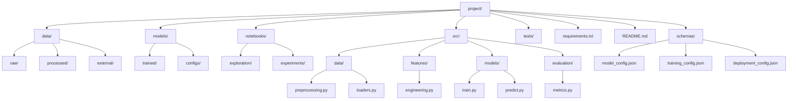

## MLOps and Infrastructure

### MLOps Pipeline Architecture

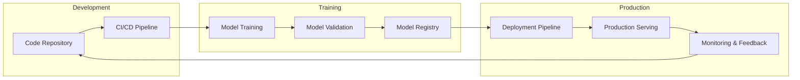

### Model Lifecycle Management

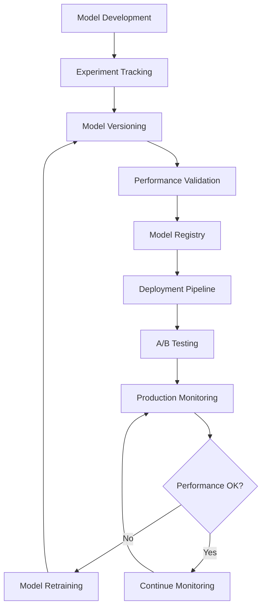

### Infrastructure Components

| Component | Purpose | Tools | Scalability |
|-----------|---------|-------|-------------|
| **Feature Store** | Centralized feature management | Feast, Tecton, AWS Feature Store | ⭐⭐⭐⭐⭐ |
| **Model Registry** | Model versioning & metadata | MLflow, DVC, Neptune | ⭐⭐⭐⭐ |
| **Training Platform** | Distributed training | Kubeflow, SageMaker, Vertex AI | ⭐⭐⭐⭐⭐ |
| **Serving Platform** | Model inference | TensorFlow Serving, Seldon, KServe | ⭐⭐⭐⭐⭐ |
| **Monitoring** | Performance & drift detection | Evidently, Alibi Detect, Arize | ⭐⭐⭐⭐ |

### CI/CD for Machine Learning

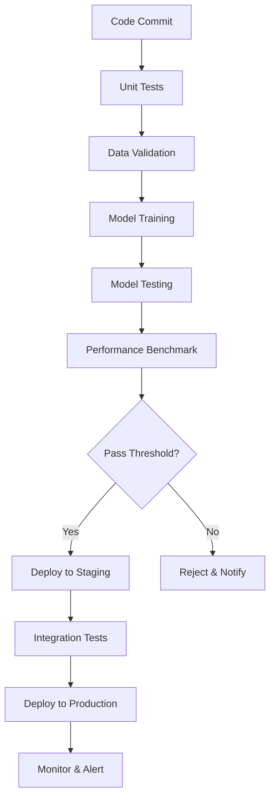

## Model Governance and Ethics

### Governance Framework

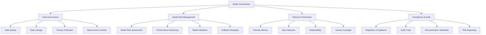

### Bias and Fairness Assessment

| Bias Type | Detection Method | Mitigation Strategy | Monitoring Frequency |
|-----------|------------------|-------------------|---------------------|
| **Historical Bias** | Statistical parity analysis | Data augmentation, resampling | Monthly |
| **Representation Bias** | Demographic parity check | Diverse data collection | Quarterly |
| **Measurement Bias** | Feature importance analysis | Feature engineering review | Bi-annually |
| **Evaluation Bias** | Cross-group validation | Multi-metric evaluation | Continuously |
| **Deployment Bias** | A/B testing analysis | Targeted interventions | Weekly |

### Model Explainability Framework

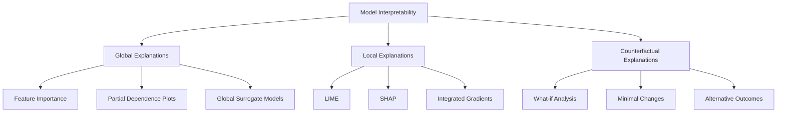

## AutoML and Advanced Techniques

### AutoML Pipeline

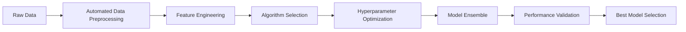

### Neural Architecture Search (NAS)

```mermaid
flowchart TD
    A[Search Space Definition] --> B[Architecture Sampling]
    B --> C[Model Training]
    C --> D[Performance Evaluation]
    D --> E[Search Strategy Update]
    E --> F{Convergence?}
    F -- No --> B
    F -- Yes --> G[Optimal Architecture]
```

### Advanced Optimization Techniques

| Technique | Use Case | Complexity | Performance Gain |
|-----------|----------|------------|------------------|
| **Bayesian Optimization** | Hyperparameter tuning | Medium | ⭐⭐⭐⭐ |
| **Multi-objective Optimization** | Pareto-optimal solutions | High | ⭐⭐⭐⭐⭐ |
| **Population-based Training** | Dynamic hyperparameter schedules | High | ⭐⭐⭐⭐ |
| **Evolutionary Algorithms** | Architecture search | Very High | ⭐⭐⭐⭐⭐ |
| **Gradient-based Meta-learning** | Few-shot learning | Very High | ⭐⭐⭐⭐⭐ |

## Common Pitfalls

### Data Leakage Prevention

```mermaid
flowchart TD
    A[Common Leakage Scenarios] --> B[Target Leakage]
    A --> C[Train-Test Contamination]
    A --> D[Temporal Leakage]
```

### Overfitting Mitigation

```mermaid
flowchart TD
    A[Regularization Techniques] --> B[L1/L2 Regularization]
    B --> B1[Sparse Weights]
    A --> C[Dropout]
    C --> C1[Random Unit Drops]
    A --> D[Early Stopping]
    D --> D1[Validation Monitoring]
```

### Bias and Fairness

Key considerations for ethical ML:

* Dataset representation and sampling bias
* Algorithmic fairness metrics
* Disparate impact assessment
* Continuous monitoring for discriminatory patterns
* Interpretability for accountability

## Conclusion

Machine learning model development is an iterative, multidisciplinary endeavor requiring careful attention to each phase of the pipeline. Success depends not merely on algorithmic sophistication, but on rigorous methodology, thoughtful design choices, and continuous refinement based on empirical evidence.

The frameworks and schemas presented in this documentation provide a foundation for systematic ML development. However, remember that each problem domain presents unique challenges requiring adaptive application of these principles. The art of machine learning lies in balancing theoretical rigor with practical constraints, always guided by the ultimate goal of creating systems that provide genuine value while maintaining ethical standards and technical excellence.

As you embark on your ML journey, maintain a scientific mindset: hypothesize, experiment, measure, and iterate. Document your process meticulously, question your assumptions regularly, and never stop learning from both successes and failures.

---

## References and Further Reading

* Hastie, T., Tibshirani, R., & Friedman, J. (2009). *The Elements of Statistical Learning*
* Bishop, C. M. (2006). *Pattern Recognition and Machine Learning*
* Goodfellow, I., Bengio, Y., & Courville, A. (2016). *Deep Learning*
* Murphy, K. P. (2012). *Machine Learning: A Probabilistic Perspective*
* Géron, A. (2019). *Hands-On Machine Learning with Scikit-Learn, Keras, and TensorFlow*

## License

This documentation is provided for educational purposes. Feel free to use, modify, and distribute with appropriate attribution.

---

*Last Updated: 2025*
*Version: 1.0.0*
