# Machine Learning Models: A Comprehensive Development Guide

## Table of Contents

1. [Introduction](#introduction)
2. [The Machine Learning Pipeline](#the-machine-learning-pipeline)
3. [Data Preparation](#data-preparation)
4. [Model Selection](#model-selection)
5. [Training Process](#training-process)
6. [Evaluation and Validation](#evaluation-and-validation)
7. [Deployment and Monitoring](#deployment-and-monitoring)
8. [Best Practices](#best-practices)
9. [Common Pitfalls](#common-pitfalls)
10. [Conclusion](#conclusion)

## Introduction

Machine Learning (ML) model development is a systematic process that transforms raw data into predictive systems capable of learning patterns and making intelligent decisions. This documentation provides a comprehensive framework for building robust, scalable, and maintainable ML models.

The journey from problem definition to deployed model requires rigorous methodology, careful consideration of trade-offs, and adherence to established principles. This guide presents the complete lifecycle of ML model development, suitable for both academic study and industrial application.

## The Machine Learning Pipeline

### Overview Schema

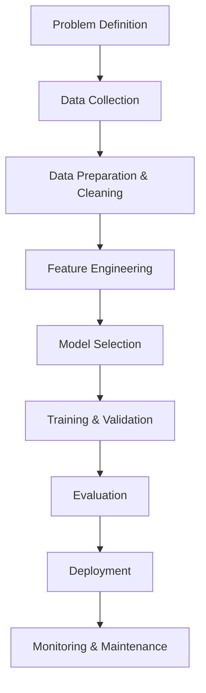

Each stage in this pipeline is critical and interconnected. Failures or oversights at any stage cascade downstream, potentially compromising the entire system.

## Data Preparation

### Data Split Architecture

```mermaid
flowchart TD
    A[Original Dataset (100%)] --> B[Training Set (80%)]
    A --> C[Test Set (20%)]
    B --> D[Train Subset (64%)]
    B --> E[Validation Subset (16%)]
```

### Data Preprocessing Pipeline

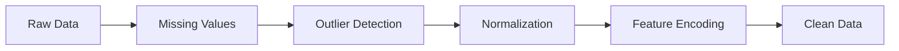

#### Key Preprocessing Steps

1. **Missing Value Treatment**

   * Deletion strategies: listwise, pairwise
   * Imputation methods: mean, median, mode, forward-fill, interpolation
   * Advanced techniques: KNN imputation, MICE, deep learning imputation

2. **Outlier Detection**

   * Statistical methods: Z-score, IQR, Mahalanobis distance
   * Machine learning methods: Isolation Forest, LOF, DBSCAN
   * Domain-specific thresholds

3. **Feature Scaling**

   * Standardization: μ = 0, σ = 1
   * Normalization: \[0, 1] or \[-1, 1]
   * Robust scaling: using median and IQR

## Model Selection

### Model Taxonomy

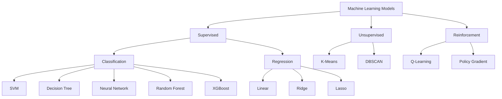

### Model Selection Criteria

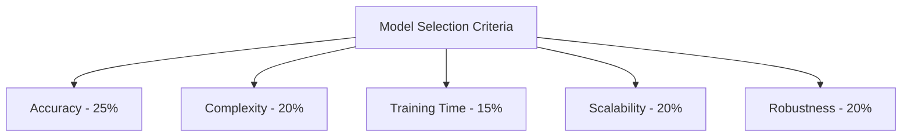

## Training Process

### Training Loop Architecture

```mermaid
flowchart TD
    A[Start] --> B[Initialize Parameters]
    B --> C[Forward Pass: ŷ = f(X, θ)]
    C --> D[Compute Loss: L = loss(y, ŷ)]
    D --> E[Backward Pass: ∇θ = ∂L/∂θ]
    E --> F[Update Parameters: θ = θ - α∇θ]
    F --> G{Convergence?}
    G -- No --> C
    G -- Yes --> H[Return Model]
```

### Hyperparameter Optimization

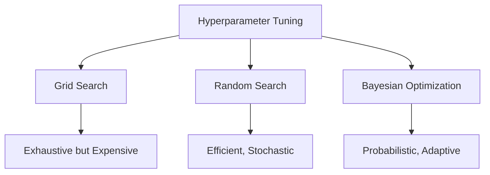

## Evaluation and Validation

### Cross-Validation Schema

```mermaid
flowchart TD
    A[K-Fold Cross Validation (K=5)] --> B[Fold 1: Valid + Train x4]
    A --> C[Fold 2: Train + Valid + Train x3]
    A --> D[Fold 3: Train x2 + Valid + Train x2]
    A --> E[Fold 4: Train x3 + Valid + Train]
    A --> F[Fold 5: Train x4 + Valid]
    F --> G[Aggregate Performance & Std. Dev.]
```

### Evaluation Metrics Framework

#### Classification Metrics

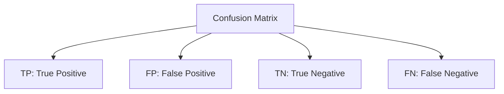

* Precision = TP / (TP + FP)
* Recall = TP / (TP + FN)
* F1 = 2 × (Precision × Recall) / (Precision + Recall)
* Accuracy = (TP + TN) / (TP + TN + FP + FN)

#### Regression Metrics

```
MSE = (1/n) Σ(yi - ŷi)²
RMSE = √MSE
MAE = (1/n) Σ|yi - ŷi|
R² = 1 - (SS_res / SS_tot)
```

### Model Diagnostics

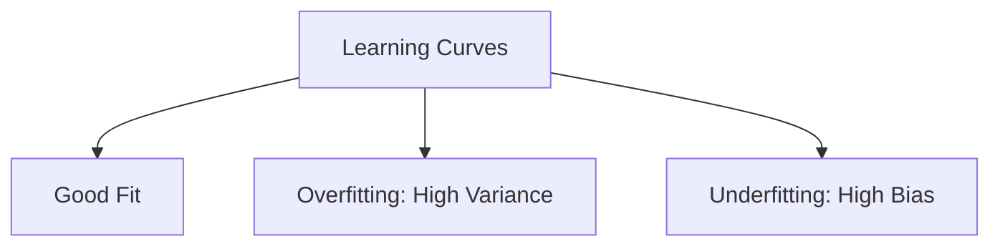

## Deployment and Monitoring

### Deployment Architecture

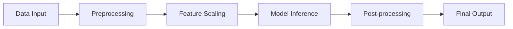

### Model Monitoring Framework

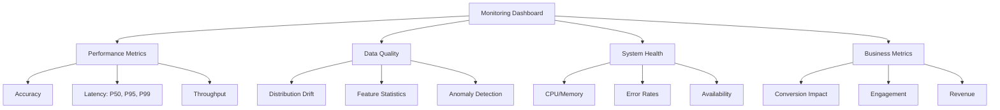

## Best Practices

### Development Workflow

1. **Version Control**

   * Track code, data versions, and model artifacts
   * Use semantic versioning for models
   * Maintain reproducibility through environment specifications

2. **Experiment Tracking**

   ```
   Experiment Registry
   ├── Experiment ID
   ├── Hyperparameters
   ├── Metrics
   ├── Artifacts
   ├── Code Version
   └── Timestamp
   ```

3. **Testing Strategy**

   * Unit tests for data preprocessing
   * Integration tests for pipeline components
   * Performance regression tests
   * A/B testing in production

4. **Documentation Standards**

   * Model cards describing purpose, performance, limitations
   * API documentation for model endpoints
   * Training procedure documentation
   * Data lineage tracking

### Code Organization

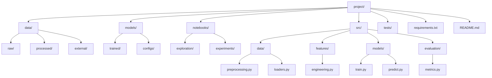

## Common Pitfalls

### Data Leakage Prevention

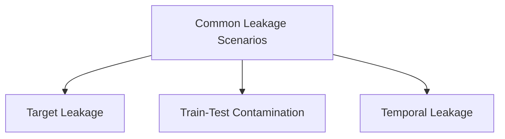

### Overfitting Mitigation

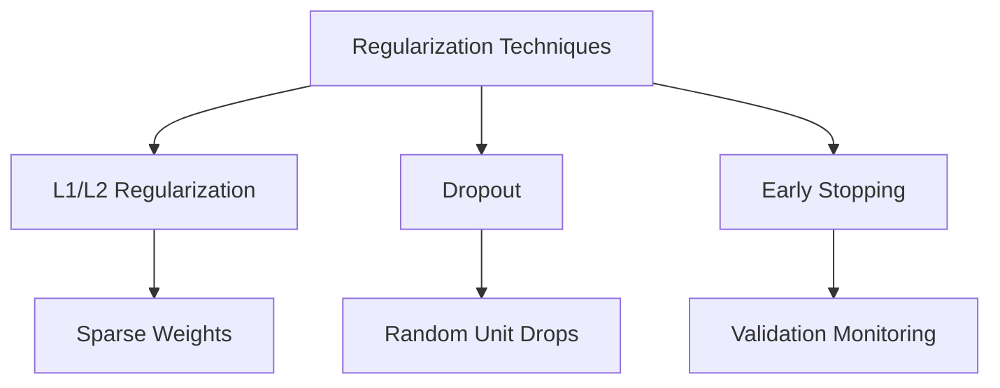

### Bias and Fairness

Key considerations for ethical ML:

* Dataset representation and sampling bias
* Algorithmic fairness metrics
* Disparate impact assessment
* Continuous monitoring for discriminatory patterns
* Interpretability for accountability

## Conclusion

Machine learning model development is an iterative, multidisciplinary endeavor requiring careful attention to each phase of the pipeline. Success depends not merely on algorithmic sophistication, but on rigorous methodology, thoughtful design choices, and continuous refinement based on empirical evidence.

The frameworks and schemas presented in this documentation provide a foundation for systematic ML development. However, remember that each problem domain presents unique challenges requiring adaptive application of these principles. The art of machine learning lies in balancing theoretical rigor with practical constraints, always guided by the ultimate goal of creating systems that provide genuine value while maintaining ethical standards and technical excellence.

As you embark on your ML journey, maintain a scientific mindset: hypothesize, experiment, measure, and iterate. Document your process meticulously, question your assumptions regularly, and never stop learning from both successes and failures.

---

## References and Further Reading

* Hastie, T., Tibshirani, R., & Friedman, J. (2009). *The Elements of Statistical Learning*
* Bishop, C. M. (2006). *Pattern Recognition and Machine Learning*
* Goodfellow, I., Bengio, Y., & Courville, A. (2016). *Deep Learning*
* Murphy, K. P. (2012). *Machine Learning: A Probabilistic Perspective*
* Géron, A. (2019). *Hands-On Machine Learning with Scikit-Learn, Keras, and TensorFlow*

## License

This documentation is provided for educational purposes. Feel free to use, modify, and distribute with appropriate attribution.

---

*Last Updated: 2025*
*Version: 1.0.0*
